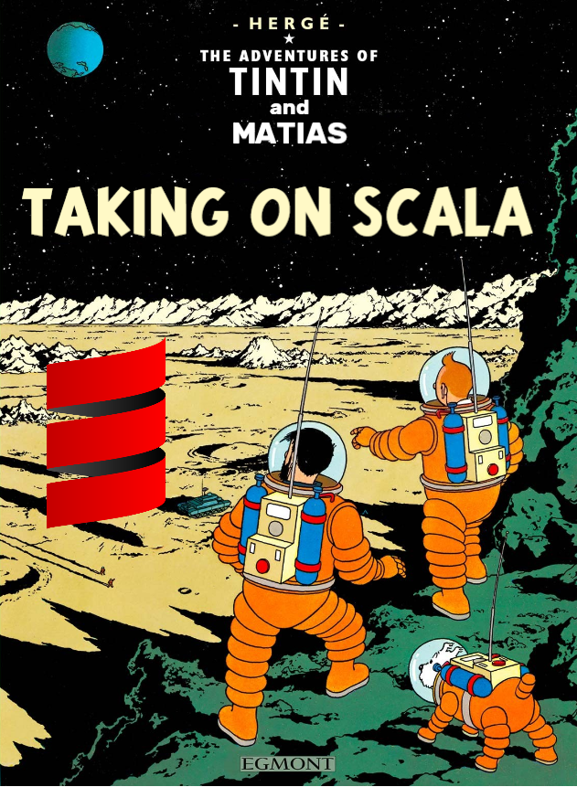
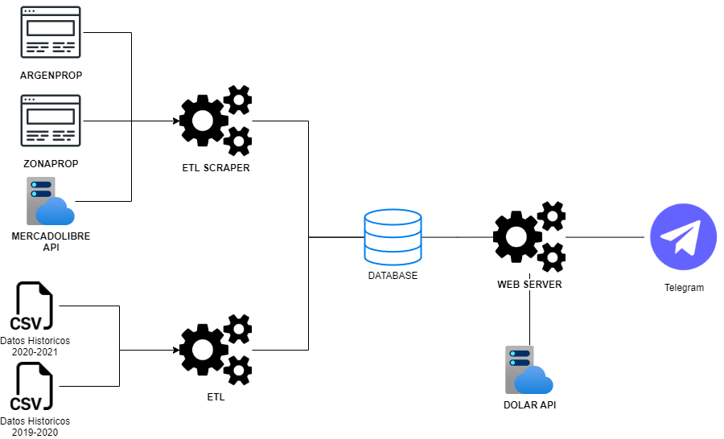

# TDL-7531-TP-Scala

El proyecto de Teoria del Lenguaje en Scala. Un bot de telegram que permite buscar informacion sobre propiedades en venta y alquiler en CABA

## Estructura del Proyecto

## Miembros

- Martin Pata Fraile de Manterola
- Martin Stefanelli
- Matías Daniel Huenul

